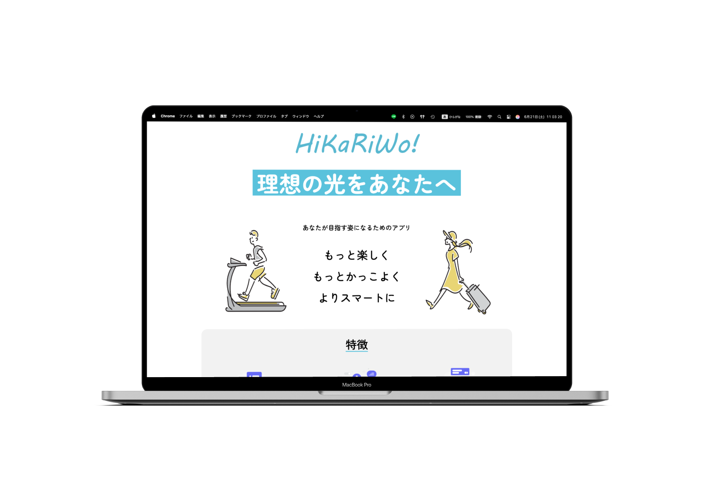

# TECJUM_teamE_hikariwo_LP
KADOKAWAドワンゴ情報工科学院内、冬の開発イベント『Tech Jum』 
サントリーグローバルイノベーションセンター様との産学連携でのチーム制作

## チームメンバー
  #### プロジェクトリーダー
  赤堀匠海　 

  #### フロントエンド
  鈴木至恩　 
  長田絹人　 
  赤堀匠海　 

  #### バックエンド
  桑野樹希　 
  中西拳也　 

  #### プレゼンテーション
  長田絹人　 

  
    

### 私がイベントで担当した箇所
  プロジェクトリーダー  
  Hikariwoデザイン  
  ランディングページの制作  

## 使用言語
  HTML/CSS:サイトデザインで使用
   
  JavaScript:サイトアニメーションで使用

# view

  
  

